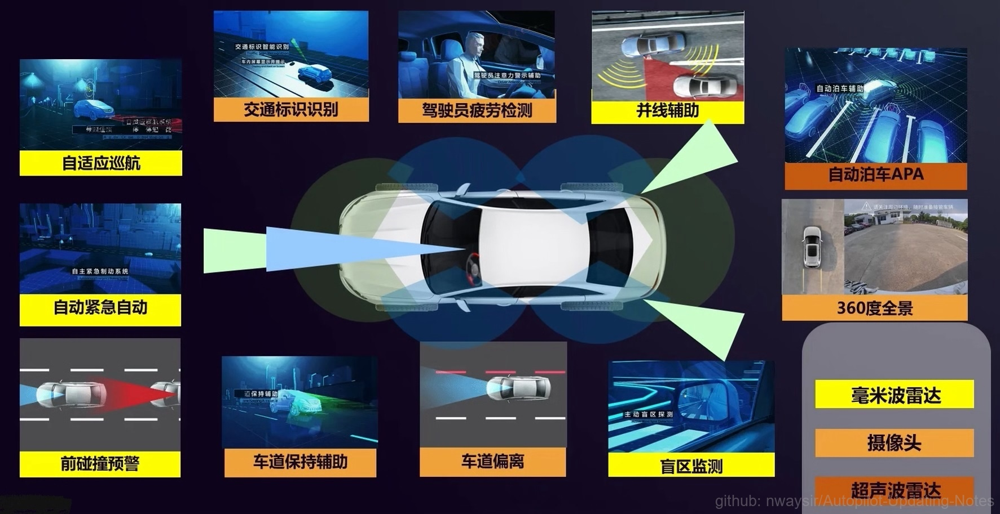
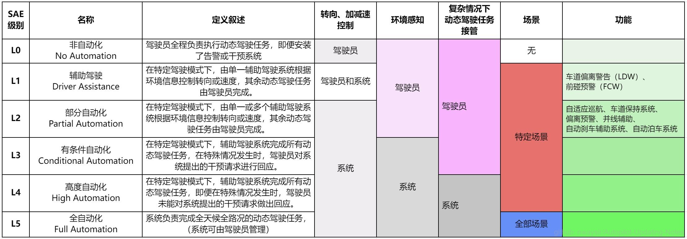

# 《自动驾驶更新笔记 Autopilot Updating Notes》

### 重点
**由于作者水平有限，希望大家积极提交改进意见**, 您可对相关xxx.md进行修改,并将意见记录在modify_log.txt中。**我将对修改内容进行整理，以保证知识的准确性**。

## 一、内容简介
随着各大科技公司积极布局，自动驾驶成为新的风口。本文旨在总结分享自动驾驶的技术方案，希望帮助大家对相关知识的学习了解。

## 二、自动驾驶分级（SAE 美国汽车工程协会）

## 三、架构

自动驾驶系统主要包含三部分：环境感知、决策规划以及运动控制。感知层对车辆周边环境进行感知识别，用于获取环境信息；决策层充当人类驾驶员的角色，主要解决三个核心问题：“我在哪？我要去哪？我该如何去？”；控制层保证各项硬件系统稳定的运行在计算好的最佳设定值上；保证各项子系统的运行维持在最优的区间范围；规避可能性风险，精准调控至最佳路径。

## 四、目录

**1.基础** \
1.1 Frenet坐标系 \
**2. 硬件** \
2.1 传感器 \
2.3 车和线控系统 \
2.4 计算单元 \
2.5 辅助单元 \
**3. 感知** \
3.1 识别 \
3.1.1 摄像头 \
3.1.2 激光雷达 \
3.1.3 毫米波雷达 \
3.1.4 超声波雷达 \
3.2 定位 \
3.2.1 GPS \
3.2.2 IMU \
**4.预测** \
4.4 基于车道序列的预测 \
**5. 策略规划** \
5.1 路线规划 \
5.2 轨迹规划 \
5.2.1 笛卡尔坐标下的规划 \
5.2.2 Lattice规划 \
**6. 控制** \
6.1 PID控制 \
6.2 线性二次调节器（LQR）\
6.3 模型控制预测（MPC）\
**7. ADAS** 

