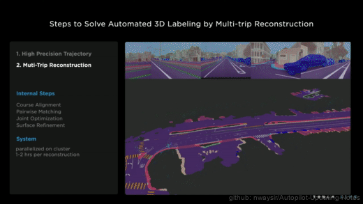
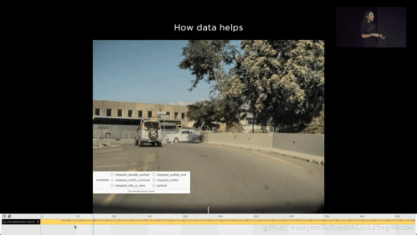

### 8.1.4 数据标注、采集、虚拟化

现阶段，人工智能的实现多数基于数据标注；广义上，数据喂的越多，算法效果越精准。所以海量数据是精准算法的基础，而海量数据的前提是这些数据带标签，即标注信息。

数据标注有两种方法，一种是人工标注，依靠人给数据打标签，非常消耗人力物力，更重要的是时间。一种是自动标注，比如采用聚类的方式，自动标注显然是省时省力的事情，下文将分析特斯拉自动标注方法。

特斯拉认为他要实现十字路口车道算法，大概需要几千万个驾驶旅程，经过大概百万个十字路口。特斯拉目前大概每天有50万个旅程，但是要把这些旅程转化成可训练的数据是非常难的课题，特斯拉表示尝试了各种人工和自动标注方法，显然不太可能。为此，特斯拉开发了新自动标注算法耗时12个小时对1万个驾驶旅程，相当于500万小时的人工标注。

### 8.1.4.1 自动标注步骤

特斯拉表示其车道算法的自动标注，主要采用以下三个步骤来实施：

图1. 车道的自动标注

（1）高精轨迹获取

>特斯拉每天可以获取50万个旅程，这些旅程的采集信息为车辆的视频，车辆运动IMU陀螺仪，速度作为原始信号输入，之后在车上的2个CPU线程（所有开通FSD的车辆产生这些信息）去跟踪优化，特征提取输出车辆6个自由度100hz的运动轨迹以及3D结构的道路细节。

(2)多旅程重构

>由于获取的数据来自不同车辆，所以还需要得到每辆车的高精轨迹信息，进行旅程的道路信息的匹配、重构、接缝优化、包面优化，最后人工分析师进行验证，形成多重旅程的轨迹信息。

(3)自动标注旅程

>自动标注只会去标注新添加的旅程，而不是去重构所有的片段，相比于几小时的人工标注，自动标注仅需半个小时就可以完成一段旅程的标注。

图2. 自动标注过程 

自动标注方式极其容易规模化，只需要有计算单元以及驾驶旅程信息，如上图2所示，此片段时间内，自动标注系统标注了来自53台车的50组数据。自动标注的方法应用于特斯拉算法的各个方面。

### 8.1.4.2 构建3D虚拟场景

现实的数据获取困难同时很难去标注，但传统的3D场景重构缓慢，所以特斯拉在虚拟验证方面，应用新的方法5分钟就能够构建3D虚拟场景。

**一、介绍**

特斯拉的建模是首先把场景的真值（Ground truth）输入3D建模软件Houdini，先开始构建道路的边缘，在构建路面地理特征，之后将车道信息投影进入路面，接下来使用道路中间的边缘形成绿化岛。这样基本的主要特征形成，那么道路两边的树以及建筑物都可以随机构建。

图3. 车道线投影建模

车道信息基础上可以引入地图交通信息，如红绿灯、行人、道路名等信息，形成了场景的基础；当然还有天气、光线等形成模拟场景。特斯拉更进一步去改变道路的真值形成新的场景，例如十字路口车道线场景，可以改变里面的车道信息，创建更多基于真实场景的变种场景，来帮助算法训练，而不是只能通过现实采集。在构建虚拟数据后，可以快速的进行各种场景的虚拟测试去优化算法，而省去实际测试费时费力的时间。

**二、场景构建架构**

图4. 场景构建架构

构建过程如上图4所示，先有道路交通真值信息，然后元素创造者将交通信息标签转换成元素，例如上文将到的车道线，马路牙子，建筑物等都属于元素。再通过元素提取工具将这些信息分成几何信息和交通实例元素放到150平米Geohash中，并给他命名ID 方便使用加载调用。

这样建模信息更加简洁，更容易加载和渲染，然后使用元素加载器工具，特斯拉可以使用Geohash ID编码去加载任意数量的缓存切片，一般虚拟的时间就加载感兴趣的地点以及周边。最后是虚拟引擎生成场景。

**二、场景构建流程**

图5. 场景构建流程

基于以上流程，工程师2周就可以生成旧金山的街道虚拟世界，而非几个月甚至年来做单位。相同的技术可以拓展到城市和国家，或者更新原有的虚拟世界，确保数据依据现实动态发展。

**三、现实数据采集器**

图6. Corner Case极端场景 

特斯拉的仿真能力虽然很强，但很多corner case 极端的场景依然需要真实场景数据。如上图6所示，特斯拉的FSD正在进入弯路口，通过这里的时候，看到旁边有一个车子，现有算法下的特斯拉会认为有车子在等待通行，所以特斯拉自动驾驶车子会减速，但现实这是一个没有人在里面的奇怪停车。

此类场景估计任何脑洞大开的虚拟验证都不会想到，必须要有实际场景来识别这类corner case极端场景，所以自动驾驶真实场景数据的收割必须要有，而且还是动态发展的，不同时间，不同城市，不同文化的数据都会不一样。
所以特斯拉构建了一个工具去识别错误的判断并去纠正标签，并把这个片段归类为需要重新评估的系列。这个场景特斯拉把它诊断为挑战性的在转弯处有停车的场景，目前特斯拉识别了126个这样的场景，挖掘以及促进训练了1.39万视频数据，来提升预测准确性。

**四、数据引擎**

图7. 数据引擎

特斯拉解决这类场景需要成千上万这种场景，而特斯拉利用数据采集车辆（客户的车或试验车），以及设备去采集和更正标签来解决这种琐碎的场景。把这种数据引擎框架实施到所有算法的持续优化中，数据引擎是一个完整的从实验车型，虚拟验证，终端用户的流。特斯拉能够大规模使用数据引擎的基础设施为算法提供数据食物，得益于其庞大的车队（终端用户汽车影子模式传输客户使用FSD时候的介入信息以及实验车队的再确认数据）。
